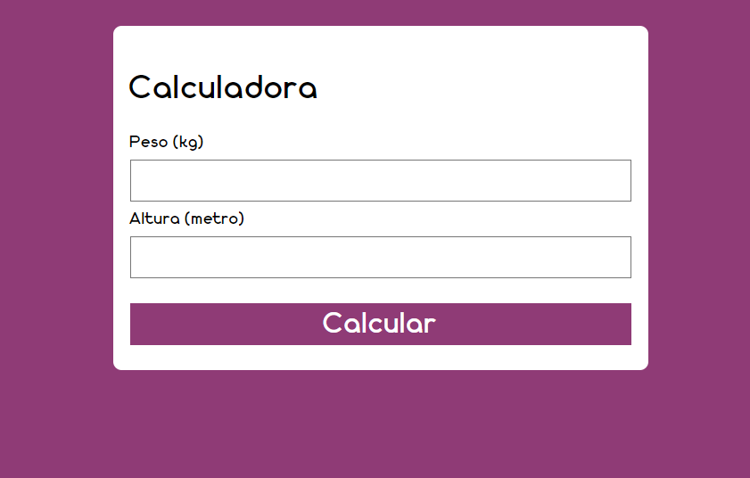

# 🌟 Calculadora de IMC - Índice de Massa Corporal 🌟

## Descrição

<p align='justify'>
  A Calculadora de IMC (Índice de Massa Corporal) é uma aplicação web intuitiva que permite calcular o IMC de forma simples e rápida, utilizando o peso e a altura do usuário. 
  A interface amigável fornece uma interpretação clara do resultado, categorizando o IMC de acordo com padrões universalmente reconhecidos. 
  Este projeto é uma excelente demonstração das minhas habilidades em **HTML**, **CSS** e **JavaScript**, além de refletir boas práticas de codificação e design responsivo.
</p>

## Funcionalidades

- **Cálculo do IMC**: Calcule seu IMC de forma rápida, com base nos dados que você inserir.
- **Classificação do IMC**: Receba feedback instantâneo sobre sua classificação, como "Abaixo do peso", "Peso normal", "Sobrepeso", entre outros.
- **Design Responsivo**: A interface se adapta a diferentes tamanhos de tela, garantindo uma experiência de usuário fluida em dispositivos móveis e desktop.

## Tecnologias Utilizadas

- **HTML**: Estrutura básica da página e criação de formulários.
- **CSS**: Estilização e design responsivo para uma apresentação estética.
- **JavaScript**: Lógica de cálculo do IMC e interatividade no DOM.

## 🚀 Como Usar

Siga os passos abaixo para instalar e utilizar a aplicação:

1. **Clone o Repositório**

   ```bash
   git clone https://github.com/joi/calculadora-imc.git
   Navegue para o Diretório do Projeto

   Abra o Arquivo HTML
   Use um navegador para abrir o arquivo index.html e veja a aplicação funcionando.
   Estrutura de Arquivos

   calculadora-imc/
    ├── src/
    |
    ├── assets/
    │   └── font    # Arquivo de fonte
    │   └── img     # Arquivo de imagem
    └── css/
    |    └── style.css    # Arquivo de estilo CSS
    |
    └── js/
    |    └── main.js    # Arquivo de script JavaScript
    |
    └── index.html    # Arquivo principal da aplicação
   ```

❗ Exemplo de Uso

Insira seu peso e altura nos campos fornecidos.
Clique no botão "Calcular".
O resultado do seu IMC será exibido logo abaixo, junto com a classificação correspondente.
📸 Screenshots


```

👷‍♀️ Contribuindo
Contribuições são bem-vindas! Siga as etapas abaixo para contribuir com o projeto:

Faça um fork do repositório.
Crie uma branch para suas alterações.
Realize suas modificações e faça commit.
Envie um pull request para o branch principal.
Licença
Este projeto está licenciado sob a MIT License.

📧 Contato
Se você tiver alguma dúvida ou sugestão, sinta-se à vontade para me contatar:

E-mail: joicekelly12@hotmail.com
GitHub: Joice-Kelly
Agradeço por conferir meu projeto! Espero que você goste da Calculadora de IMC e a ache útil!
```
